# Chapter 3 — System Analysis and Design

This chapter presents the analysis and design of *Together* through a complete set
of models: the requirements and system context, the architecture, the static
structure (class and data models), the dynamic behaviour (data-flow, activity, and
state models), the interaction (sequence) diagrams for each major scenario, and
the datasets used. The detailed design of the two recognition models is deferred
to Chapter 4.

## 3.1 Design Approach

The literature review concluded that the strongest end-to-end translation models
are infeasible for a low-resource language because they require large parallel
corpora of continuous signing. *Together* therefore adopts a **modular,
gloss-mediated design**: it recognises *isolated* signs, accumulates them into a
gloss sequence, and uses a general-purpose large language model to convert that
gloss into a grammatical sentence. This decomposition removes the dependence on a
parallel signing corpus, lets each language use a recogniser suited to its own
data, and isolates the hardest linguistic step in a replaceable component. The same
principle runs in reverse for synthesis, and both directions combine in a real-time
meeting service.

## 3.2 Requirements and System Context

The system's boundary and its interactions with users and external services are
shown in the context diagram of Fig. 3.1. Two human actors — a **Signer** and a
**Speaker** — exchange sign and spoken language with the system, which in turn
relies on MediaPipe (in the browser), cloud and offline AI providers, and a
PostgreSQL database.

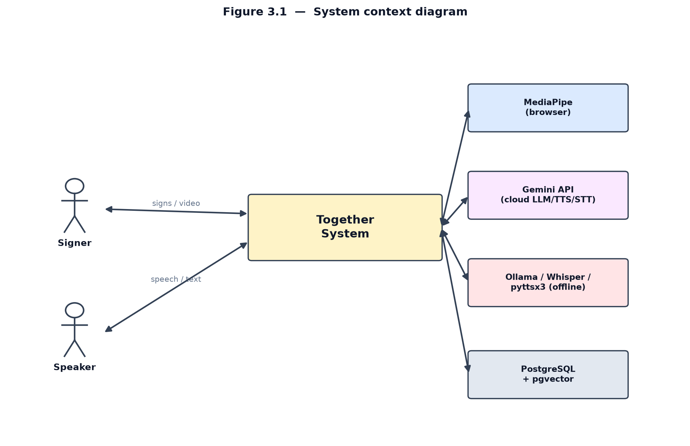

**Figure 3.1 — System context diagram.**

The functional behaviour expected by these actors is captured in the use-case
diagram of Fig. 3.2.

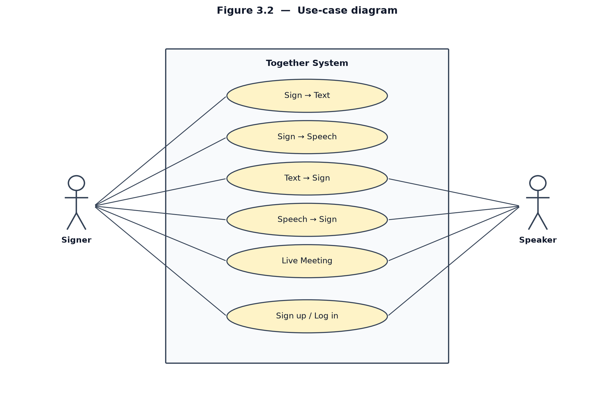

**Figure 3.2 — Use-case diagram.**

**Functional requirements.** (FR1) extract pose, hand, and face landmarks in the
browser; (FR2) recognise isolated ASL and ArSL signs; (FR3) assemble gloss and form
a grammatical sentence; (FR4) speak the sentence; (FR5) render text/speech as a sign
avatar; (FR6) host a live two-person meeting; (FR7) provide registration, login, and
sessions; (FR8) offer a bilingual (EN/AR) interface.

**Non-functional requirements.** (NFR1) interactive latency; (NFR2) zero install —
browser and webcam only; (NFR3) graceful offline degradation; (NFR4) hashed
credentials, signed tokens, rate limiting; (NFR5) RTL and accessibility support;
(NFR6) modularity; (NFR7) reproducibility from public datasets.

## 3.3 System Architecture

*Together* is organised into four layers, shown in Fig. 3.3: a browser presentation
layer, a FastAPI + Socket.IO application layer, a machine-learning and provider
layer, and a PostgreSQL + pgvector data layer.

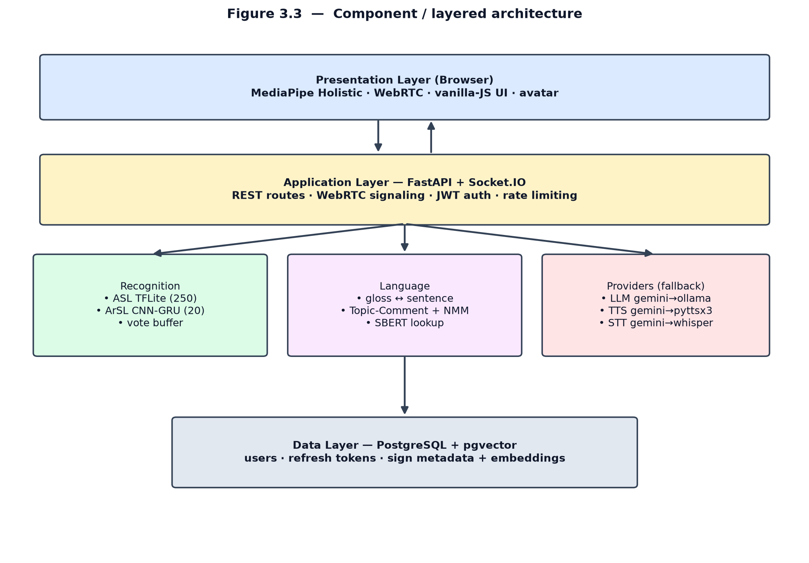

**Figure 3.3 — Component / layered architecture.**

## 3.4 Class Design

The back-end is decomposed into the service classes shown in Fig. 3.4: recognition
services for each language, a gloss engine, semantic sign databases, the provider
chain, the authentication service, the meeting hub, and a persistence repository.

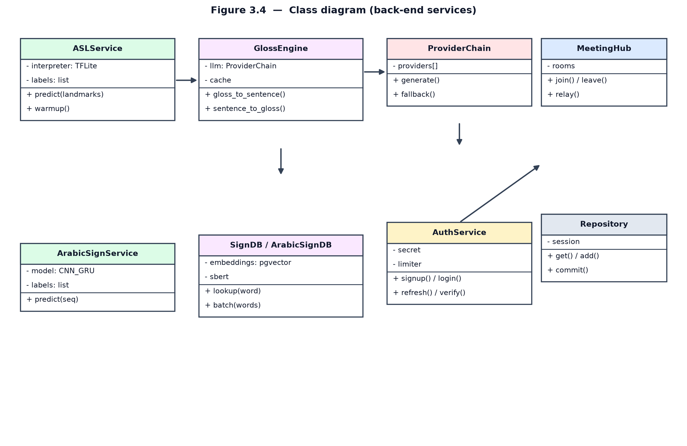

**Figure 3.4 — Class diagram (back-end services).**

## 3.5 Deployment

Fig. 3.5 shows how the components are distributed at run time: the browser client,
the containerised web server (FastAPI, TFLite, PyTorch, SBERT), the database server,
a local Ollama service for offline language generation, and the cloud Gemini
provider. Meeting media flows peer-to-peer over WebRTC.

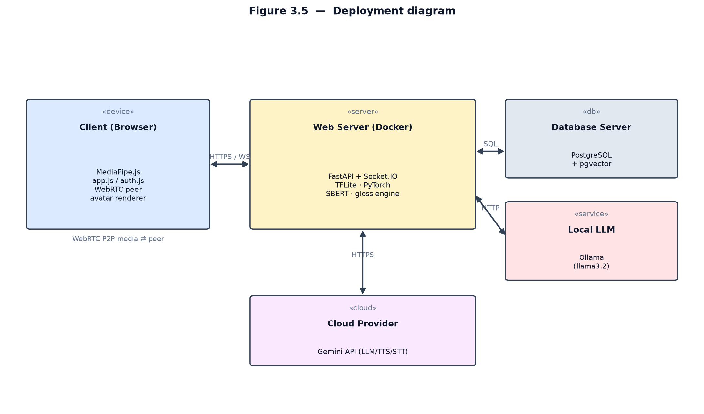

**Figure 3.5 — Deployment diagram.**

## 3.6 Data Model

The persistent state is modelled by three entities, shown in Fig. 3.6: `users`
(credentials stored as a hash), `refresh_tokens` (hashed, expiring, one-to-many with
`users`), and `signs` (per-language sign metadata with a vector embedding queried by
semantic similarity through pgvector).

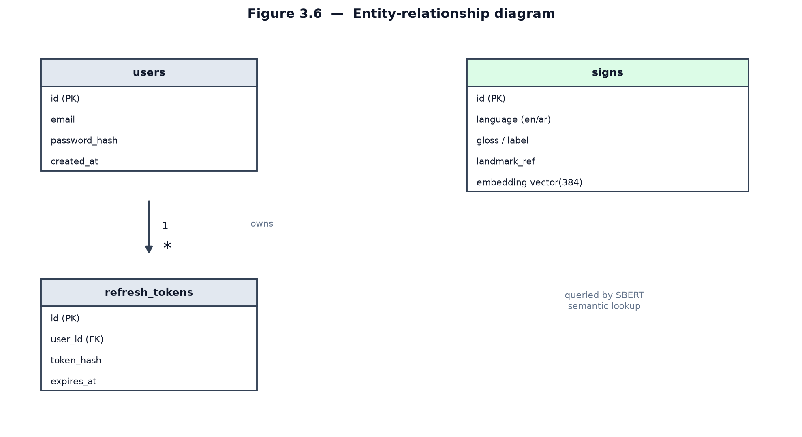

**Figure 3.6 — Entity-relationship diagram.**

## 3.7 Data-Flow Design

The level-1 data-flow diagram of Fig. 3.7 traces information through the system:
landmark extraction, recognition and voting, gloss-to-sentence translation in the
forward direction, and sentence-to-gloss plus synthesis in the reverse direction,
backed by the sign data store.

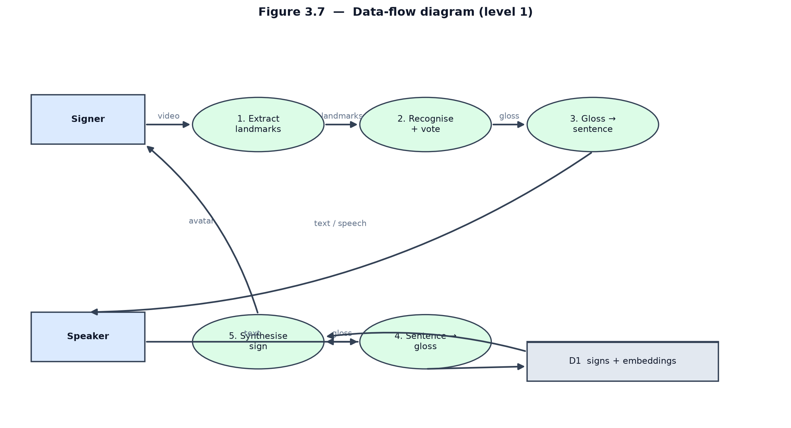

**Figure 3.7 — Data-flow diagram (level 1).**

## 3.8 Activity Design

Fig. 3.8 details the control flow of the sign-to-sentence process, including the
confidence gate, the majority vote, and the idle-timeout decision that triggers
sentence formation.

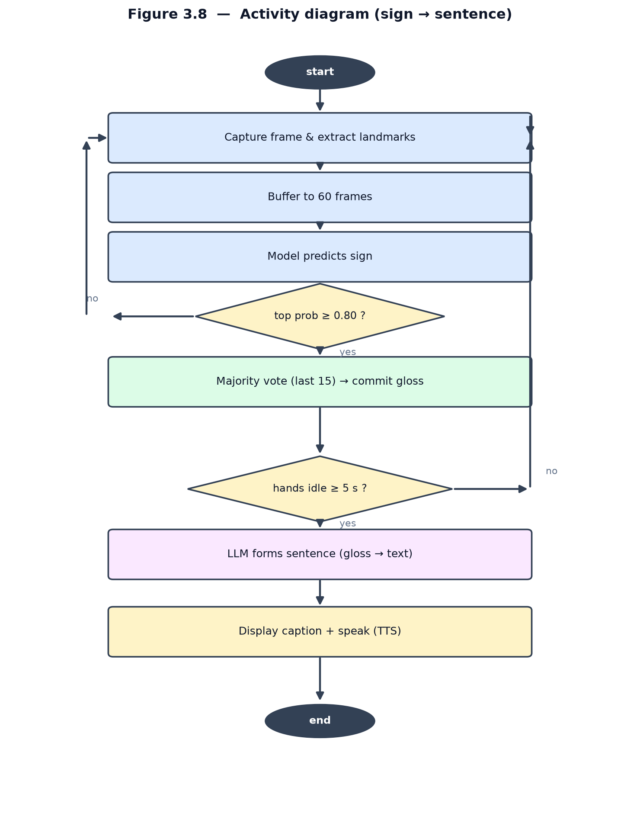

**Figure 3.8 — Activity diagram (sign → sentence).**

## 3.9 State Design

The recogniser's lifecycle is modelled as the state machine in Fig. 3.9, moving
from *Idle* through *Detecting*, *Voting*, and *Committed* to *Composing*, with
transitions for low confidence and for the idle timeout that resets the cycle.

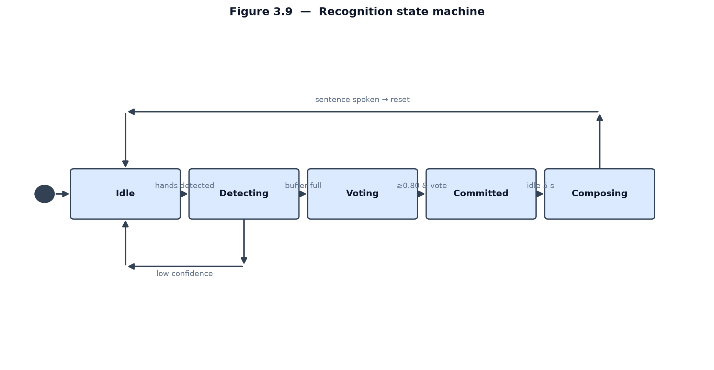

**Figure 3.9 — Recognition state machine.**

## 3.10 Interaction Design (Sequence Diagrams)

The four principal scenarios are specified as sequence diagrams. Fig. 3.10 shows
sign-to-text/speech; Fig. 3.11 shows text/speech-to-sign; Fig. 3.12 shows the live
meeting (WebRTC signaling and bidirectional translation); and Fig. 3.13 shows
authentication.

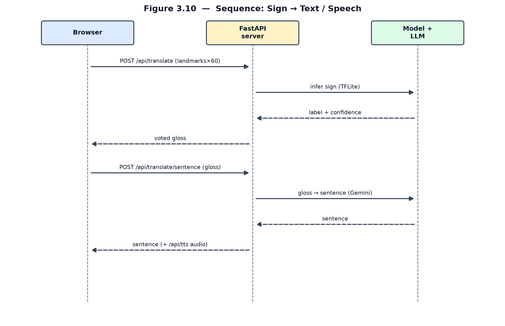

**Figure 3.10 — Sequence: Sign → Text / Speech.**

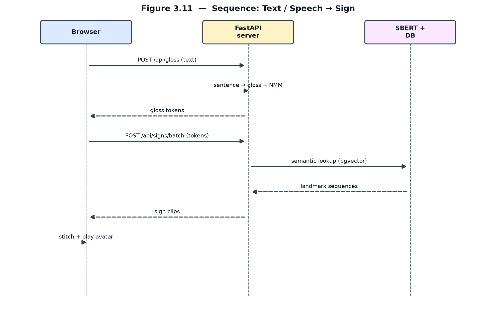

**Figure 3.11 — Sequence: Text / Speech → Sign.**

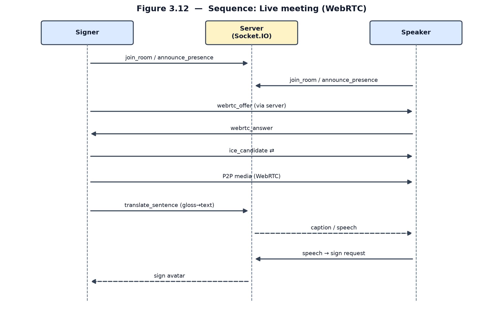

**Figure 3.12 — Sequence: Live meeting (WebRTC).**

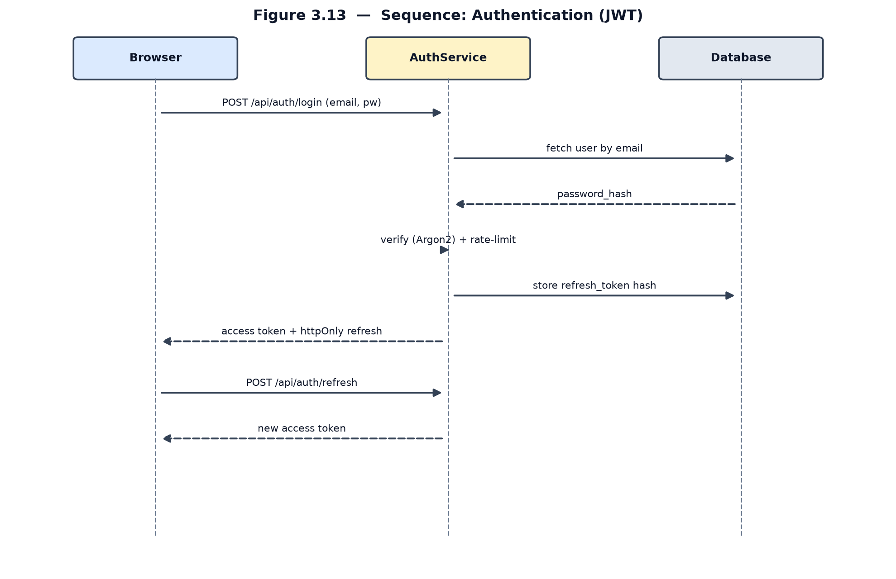

**Figure 3.13 — Sequence: Authentication (JWT).**

## 3.11 Datasets

The two recognition models are trained on **public** datasets, satisfying NFR7 and
distinguishing *Together* from the proprietary commercial systems of Chapter 2. The
ASL model uses the **Google Isolated Sign Language Recognition** dataset [25]
(~100,000 landmark sequences, 250 signs, 21 Deaf signers); a working subset of 4,078
sequences is split 68/18/14 for training, validation, and test. The ArSL model uses
the **Arabic Sign Language 20-Words dataset** of Balaha [26] (8,437 samples, 20
signs, 72 signers), split 80/10/10. Both are summarised in Table 3.1; their
preprocessing and architectures are detailed in Chapter 4.

**Table 3.1 — Datasets used to train the recognition models.**

| Dataset | Language | Classes | Samples | Signers | Representation |
| --- | --- | --- | --- | --- | --- |
| Google ISLR [25] | ASL | 250 | ~100,000 | 21 | MediaPipe landmarks (543 pts) |
| Balaha ArSL-20 [26] | ArSL | 20 | 8,437 | 72 | MediaPipe landmarks (59 pts; x, y) |

With the analysis and design established, Chapter 4 describes the implementation,
focusing on the detailed design and training of the two recognition models.
