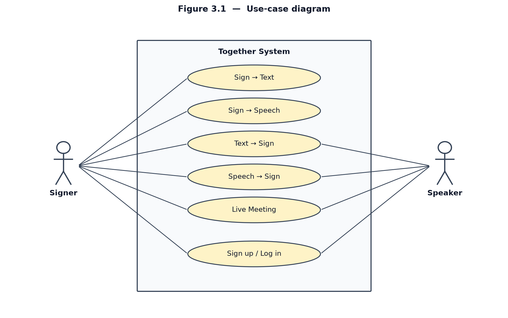
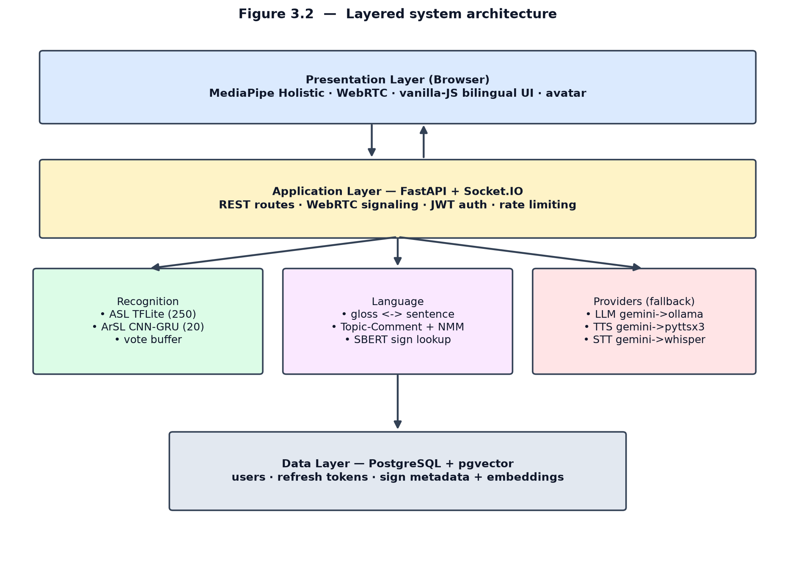
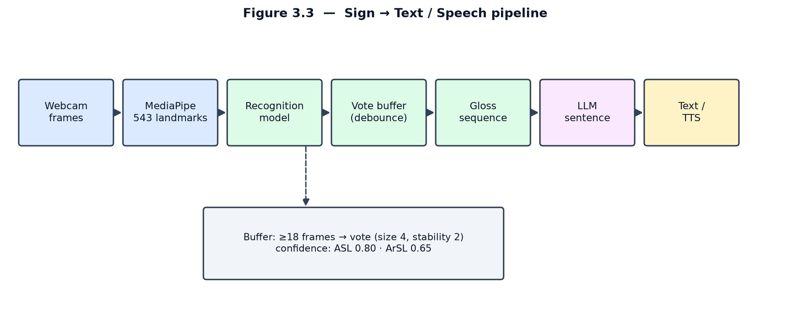
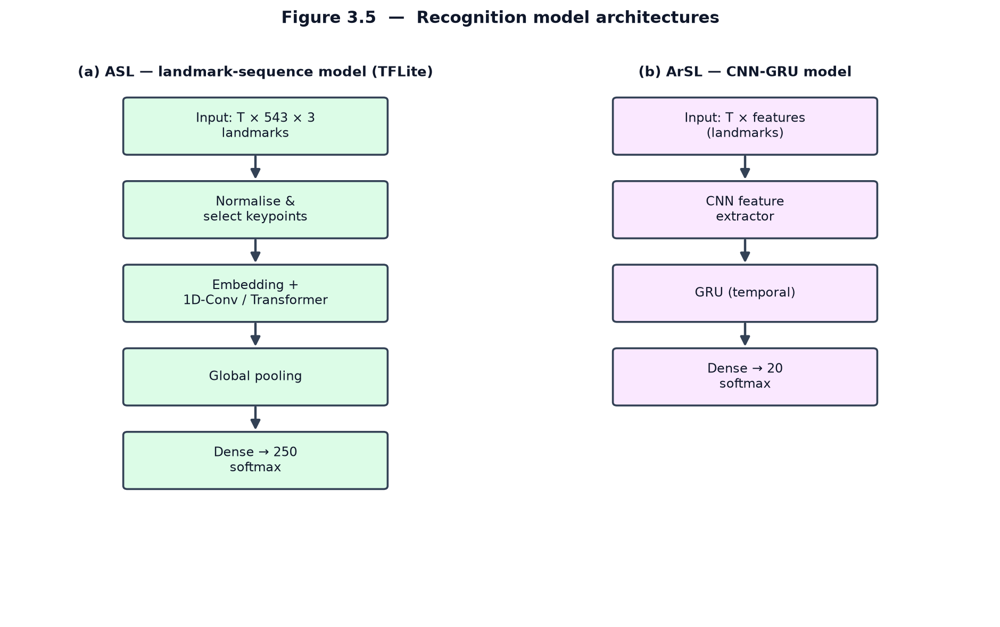
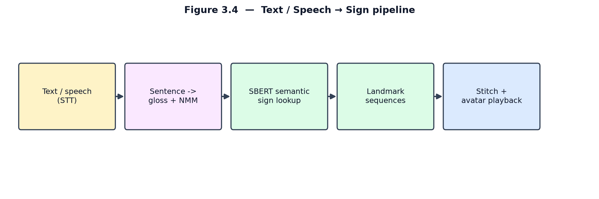
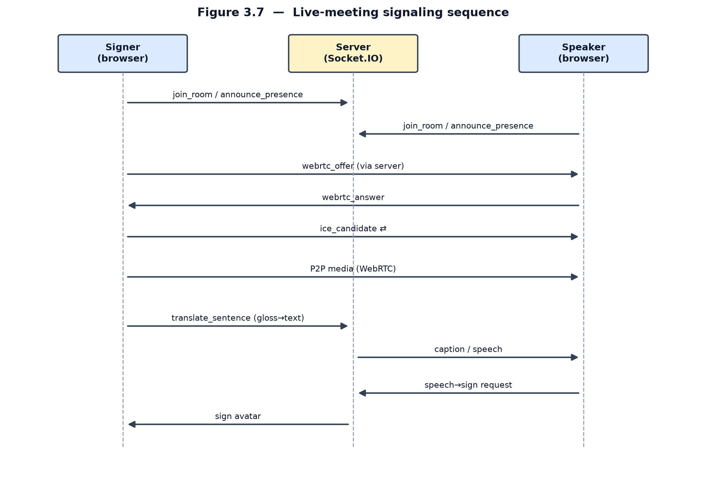
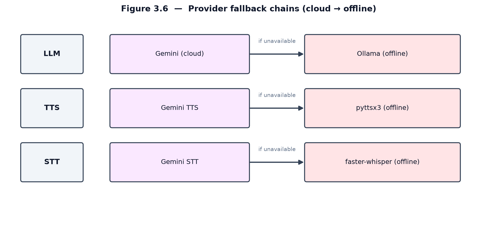
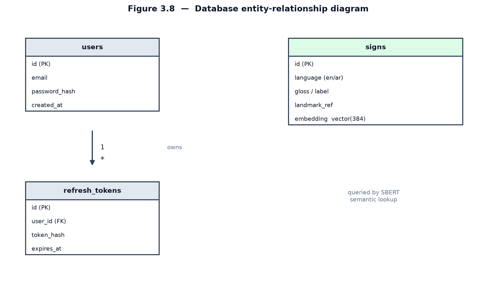

# Chapter 3 — System Analysis and Design

This chapter presents the analysis and design of *Together*. It begins with the
guiding design approach, derives the functional and non-functional requirements,
and then details the overall architecture and the design of each subsystem —
recognition, gloss-to-sentence translation, sign synthesis, the live-meeting
service, the provider strategy, and the data model. The implementation of these
designs is described in Chapter 4.

## 3.1 Design Approach

The literature review concluded that the strongest end-to-end translation models
are infeasible for a low-resource language because they require large parallel
corpora of continuous signing. *Together* therefore adopts a **modular,
gloss-mediated design**. Rather than learning sign-to-text directly, the system
recognises **isolated** signs, accumulates them into a gloss sequence, and uses a
general-purpose large language model to convert that gloss into a grammatical
sentence. This decomposition has three advantages: it removes the dependence on a
parallel signing corpus, it allows each language to use a recogniser suited to its
own data, and it isolates the hardest linguistic step (forming fluent grammar) in a
component that can be improved independently of the vision models. The same
principle runs in reverse for sign synthesis, and both directions are combined in a
real-time meeting service.

## 3.2 Requirements Analysis

The actors and the services they consume are summarised in the use-case diagram of
Fig. 3.1. Two human actors interact with the system: a **Signer**, who produces
and receives sign language, and a **Speaker**, who produces and receives spoken
language; both must also be able to authenticate.

**Figure 3.1 — Use-case diagram.**

### 3.2.1 Functional Requirements

- **FR1.** Capture webcam video in the browser and extract pose, hand, and face
  landmarks in real time.
- **FR2.** Recognise isolated signs for both American Sign Language (ASL) and
  Arabic Sign Language (ArSL).
- **FR3.** Assemble recognised signs into a gloss sequence and convert it into a
  grammatical sentence in the target spoken language.
- **FR4.** Speak the resulting sentence through text-to-speech.
- **FR5.** Convert typed or spoken input into gloss and render it as sign through
  an animated avatar.
- **FR6.** Host a live two-person meeting that translates between a signer and a
  speaker in real time.
- **FR7.** Provide user registration, login, and session management.
- **FR8.** Offer a fully bilingual interface (English LTR and Arabic RTL) with
  per-language model selection.

### 3.2.2 Non-Functional Requirements

- **NFR1 — Responsiveness.** The end-to-end pipeline must operate at interactive
  latency suitable for conversation.
- **NFR2 — Zero install.** The system must run in a standard web browser with only
  a webcam; no gloves, depth cameras, or native installation.
- **NFR3 — Availability.** Core features must degrade gracefully to offline
  components when cloud services are unreachable.
- **NFR4 — Security.** Credentials must be stored hashed, sessions protected by
  signed tokens, and abusive request rates throttled.
- **NFR5 — Accessibility.** The interface must support right-to-left layout,
  sufficient contrast, and reduced-motion preferences.
- **NFR6 — Maintainability.** The design must be modular so that a model, provider,
  or language can be replaced without affecting the rest of the system.
- **NFR7 — Reproducibility.** Models must be trainable from public datasets.

## 3.3 System Architecture

*Together* is organised into four layers, shown in Fig. 3.2. The **presentation
layer** runs entirely in the browser: MediaPipe Holistic extracts landmarks,
vanilla JavaScript renders the bilingual interface and the avatar, and WebRTC
carries peer media in meetings. The **application layer** is a FastAPI server with
an embedded Socket.IO server that exposes the REST endpoints, performs model
inference, handles WebRTC signaling, and enforces authentication and rate limiting.
The **machine-learning and provider layer** holds the two recognition models, the
gloss/sentence and semantic-lookup logic, and the pluggable provider chains. The
**data layer** is a PostgreSQL database with the pgvector extension, storing users,
refresh tokens, and sign metadata together with their embeddings.

**Figure 3.2 — Layered system architecture.**

## 3.4 Datasets

The two recognition models are trained on **public** datasets, satisfying NFR7 and
distinguishing *Together* from the proprietary commercial systems of Chapter 2.
Both are summarised in Table 3.1.

The ASL model is trained on the **Google Isolated Sign Language Recognition**
dataset [25], which contains roughly 100,000 samples spanning 250 signs performed
by 21 Deaf signers. Crucially, the dataset does not contain raw video; each sample
is a sequence of **MediaPipe landmarks** — 543 points per frame (face, pose, and
both hands), stored as x/y/z coordinates. This format aligns exactly with the
browser front-end, so the same landmark representation is used for training and for
live inference. The ArSL model is trained on the **ASL 20-Words (Arabic) dataset**
of Balaha [26], a set of 20 isolated Arabic sign words.

**Table 3.1 — Datasets used to train the recognition models.**

| Dataset | Language | Classes | Samples | Signers | Representation |
| --- | --- | --- | --- | --- | --- |
| Google ISLR [25] | ASL | 250 | ~100,000 | 21 | MediaPipe landmarks (543 pts) |
| Balaha ASL-20 [26] | ArSL | 20 | [N] | [N] | video → landmarks |

> Note: fill the bracketed ArSL sample/signer counts from the dataset page; they
> were not publicly listed at the time of writing.

## 3.5 Sign-to-Text / Speech Subsystem

The sign-to-spoken pipeline is shown in Fig. 3.3. The browser streams landmark
frames to the server, where the appropriate model classifies each isolated sign.
Because the models recognise one sign at a time, raw predictions are passed through
a **voting buffer** that debounces them before they are committed: a minimum
sequence length is required before any prediction is made, a short vote window
selects the most consistent label, and a per-language confidence threshold (0.80
for ASL, 0.65 for ArSL) rejects uncertain detections. The committed signs form a
gloss sequence, which is sent to the language stage (§3.6) and, optionally, spoken
through text-to-speech.

**Figure 3.3 — Sign → Text / Speech pipeline.**

The two recognition models are designed around the landmark representation rather
than raw pixels, as motivated in Chapter 2. Their architectures are shown in
Fig. 3.5. The ASL model consumes the 543-point landmark sequence, normalises and
selects the most informative keypoints, encodes them with a sequence model, and
classifies into 250 signs; it is exported to TFLite for efficient server-side
inference. The ArSL model is a CNN-GRU: a convolutional feature extractor followed
by a gated recurrent unit that captures temporal dynamics, ending in a 20-way
classifier.

**Figure 3.5 — Recognition model architectures.**

> Note: the exact layer configurations (depths, hidden sizes, input window length)
> are reported in Chapter 4 from the trained models.

## 3.6 Gloss-to-Sentence Translation

A gloss sequence is not a grammatical sentence. Sign languages such as ASL follow a
Topic–Comment ordering in which the topic is established before it is commented upon
[23], and they convey grammatical information — questions, negation, conditionals —
through non-manual markers rather than word order [24]. The translation stage must
therefore reorder the gloss and insert the function words and morphology that
signing expresses spatially or non-manually.

*Together* delegates this to a large language model through a few-shot prompt that
maps gloss to a fluent target sentence, caching results for repeated phrases. The
design deliberately treats the language model as a replaceable component behind a
single endpoint, so that if no model is reachable the system falls back to emitting
the raw gloss rather than failing — preserving meaning at the cost of fluency.

## 3.7 Text / Speech-to-Sign Synthesis

The reverse direction, shown in Fig. 3.4, mirrors the forward one. Spoken input is
first transcribed to text; the text is mapped to a gloss sequence with the
appropriate Topic–Comment ordering and non-manual markers; each gloss token is then
matched to a stored sign using **SBERT semantic embeddings**, so that a synonym or
paraphrase still retrieves the correct sign rather than failing on an exact-match
lookup. The retrieved landmark sequences are stitched together and played by the
avatar.

**Figure 3.4 — Text / Speech → Sign pipeline.**

## 3.8 Real-Time Meeting Subsystem

The live-meeting service combines both directions for two participants and is
designed around WebRTC for media and Socket.IO for signaling. The signaling
sequence is shown in Fig. 3.7: each participant joins a shared room and announces
presence; the peers exchange a WebRTC offer, answer, and ICE candidates through the
server; once negotiated, audio and video flow **peer-to-peer**. Translation runs on
top of this connection — the signer's recognised gloss is turned into captions and
speech for the speaker, and the speaker's transcribed speech is turned into a sign
avatar for the signer — so the two pipelines operate concurrently, one per
participant.

**Figure 3.7 — Live-meeting signaling sequence.**

## 3.9 Provider Fallback Strategy

To meet the availability requirement (NFR3), every external capability is accessed
through a **provider chain** rather than a single hard-coded service, as shown in
Fig. 3.6. Language generation, speech synthesis, and speech recognition each have a
cloud provider and an offline fallback: the system tries the cloud provider first
and, if it is unavailable, automatically falls through to a local component. This
keeps the core experience working without connectivity and avoids a single point of
failure.

**Figure 3.6 — Provider fallback chains (cloud → offline).**

## 3.10 Data Model and Security

The persistent state is modelled by three entities, shown in the
entity-relationship diagram of Fig. 3.8. The `users` entity stores account
credentials as a password **hash**, never plaintext; `refresh_tokens` holds the
hashed, expiring tokens that back session renewal, in a one-to-many relationship
with `users`; and `signs` stores the per-language sign metadata together with a
vector **embedding**, which the synthesis stage queries by semantic similarity
through pgvector.

**Figure 3.8 — Database entity-relationship diagram.**

Security is built into the design to satisfy NFR4: passwords are hashed,
authentication uses signed JSON Web Tokens with short-lived access tokens and
longer-lived refresh tokens, and a sliding-window rate limiter throttles abusive
request rates. With the analysis and design established, Chapter 4 describes how
each of these subsystems is implemented.
