# Chapter 4 — Implementation

This chapter describes the implementation of *Together*, concentrating on the two
recognition models — the heart of the system — and then the translation, synthesis,
and real-time integration that surround them. Every model is documented from input
representation through architecture, augmentation, and training.

## 4.1 Technology Stack

The system is implemented in Python with a FastAPI + Socket.IO back-end and a
server-rendered, vanilla-JavaScript front-end. Landmarks are extracted in the
browser with MediaPipe Holistic, which builds on the on-device hand-tracking models
of MediaPipe [27]. The ASL model runs through the TensorFlow Lite (LiteRT)
interpreter; the ArSL model runs in PyTorch. Semantic sign retrieval uses
Sentence-BERT [30] over a PostgreSQL + pgvector store, and language generation uses
Gemini [31] with a local LLaMA-based Ollama fallback [32].

## 4.2 The ASL Recognition Model

### 4.2.1 Input and preprocessing

The end-to-end shape flow of the ASL model is shown in Fig. 4.1. The network core
operates on a feature tensor of shape (L, C); at inference the deployed TFLite model
instead accepts the **raw** MediaPipe landmarks of shape (60, 543, 3) and performs
all preprocessing inside the graph, so the browser only sends raw coordinates.

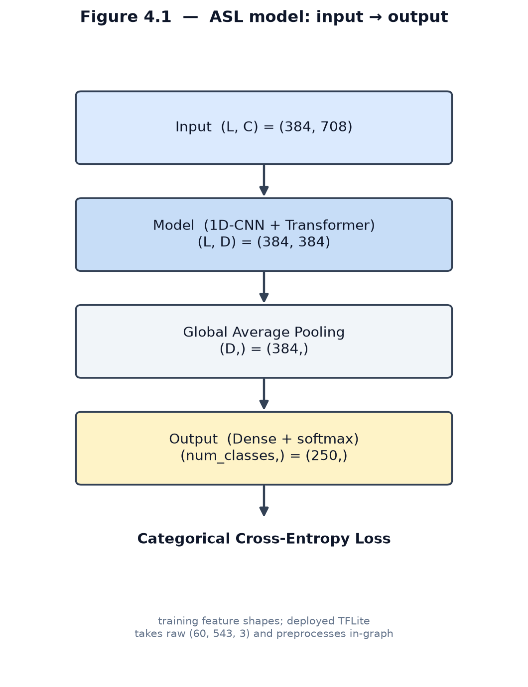

**Figure 4.1 — ASL model: input → output.**

The preprocessing stage (Fig. 4.2) selects **118** of the 543 landmarks (lips, both
hands, and upper body), **drops the z axis** to keep only (x, y), centres the
coordinates on the nose landmark, and normalises by the sequence standard deviation.
First- and second-order motion features (dx, dy and dx², dy²) are concatenated with
the coordinates, yielding **708 features per frame** (118 × 6). During training,
sequences are padded to a maximum length of 384, giving a feature tensor of shape
(384, 708).

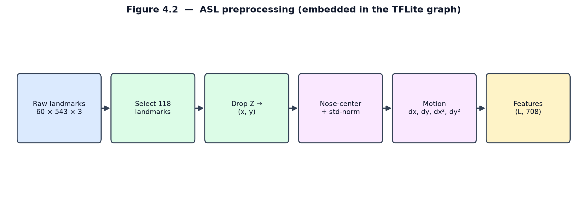

**Figure 4.2 — ASL preprocessing (embedded in the TFLite graph).**

### 4.2.2 Architecture

The model adapts the Squeezeformer design of the top-performing Google ISLR
solution. As shown in Fig. 4.3, a stem convolution projects the 708 input features
to a 192-dimensional representation, which passes through **two repetitions of three
Conv1D blocks followed by a transformer block**, then global average pooling and a
250-way softmax classifier.

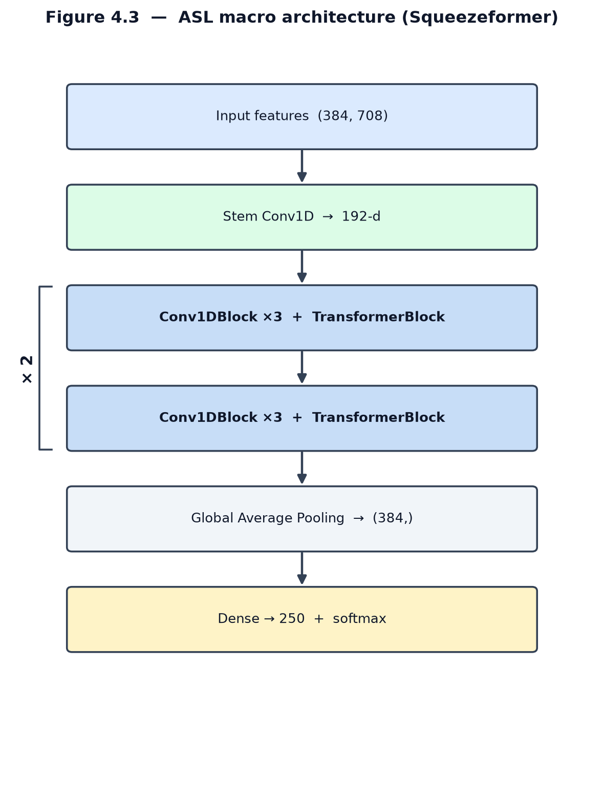

**Figure 4.3 — ASL macro architecture (Squeezeformer).**

Each Conv1D block (Fig. 4.4) combines a point-wise convolution (kernel 1), a
**causal depthwise convolution** (kernel 17) with batch normalisation, Efficient
Channel Attention, and a second point-wise convolution, wrapped in a residual
connection.

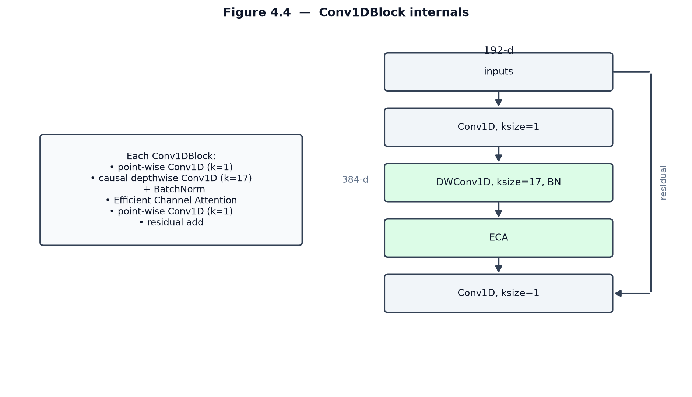

**Figure 4.4 — Conv1DBlock internals.**

Efficient Channel Attention (Fig. 4.5) recalibrates channels cheaply: it
global-average-pools each channel, applies a small 1-D convolution across channels,
and scales the features by the resulting sigmoid weights.

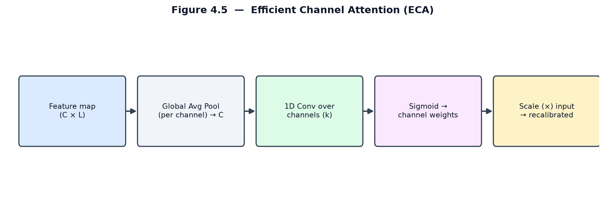

**Figure 4.5 — Efficient Channel Attention (ECA).**

The transformer block (Fig. 4.6) follows the standard design [28]: layer
normalisation, multi-head self-attention, a residual connection, then a
feed-forward MLP with its own residual.

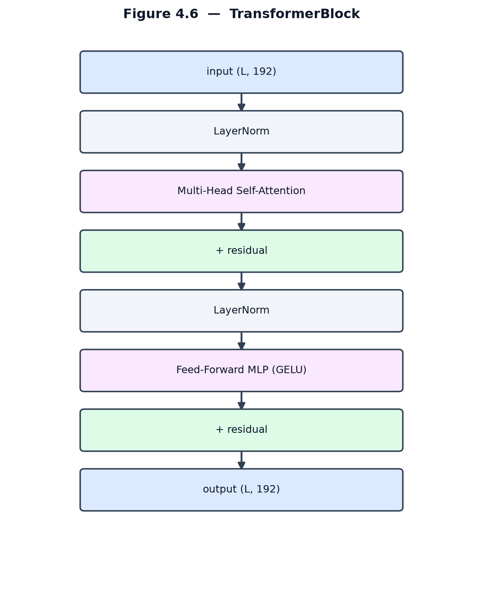

**Figure 4.6 — TransformerBlock.**

A key detail is the use of **causal padding** in the depthwise convolutions
(Fig. 4.7): unlike "same" padding, causal padding prevents padded future frames from
contaminating the output, preserving the temporal order during streaming inference.

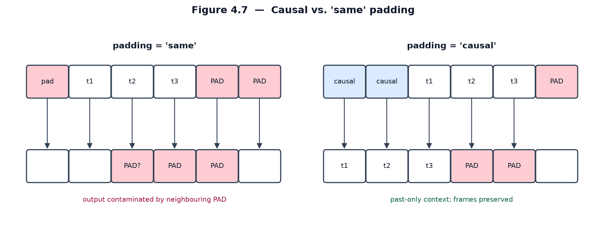

**Figure 4.7 — Causal vs. "same" padding.**

### 4.2.3 Data augmentation

To generalise across signing speeds, camera angles, and occlusions, the ASL model
is trained with the dual-modality augmentation of Fig. 4.8: temporal resampling
(0.5×–1.5×), temporal masking (20–40% of frames blanked), horizontal flipping (for
left-handed signers), random affine transforms (scale, shift, shear, rotation up to
±30°), and spatial cutout.

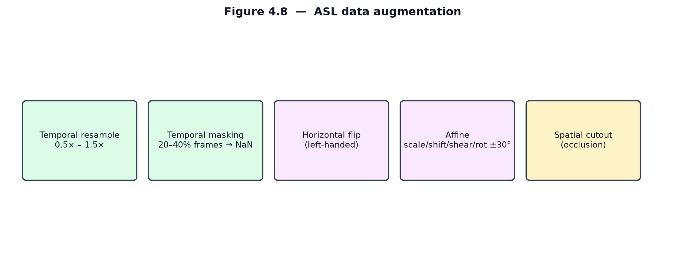

**Figure 4.8 — ASL data augmentation.**

### 4.2.4 Training and results

The training configuration is summarised in Fig. 4.9: the RAdam optimizer with a
Lookahead wrapper, a base learning rate of 5e-4 scaled to 4e-3 across replicas under
a cosine decay (no warmup), and a categorical cross-entropy loss with label
smoothing of 0.1, over 400 epochs. Three regularizers combat overfitting on the 250
classes: **Drop-Path** (stochastic depth, p = 0.2), **late dropout** (p = 0.8 on the
final dense layer), and **Adversarial Weight Perturbation** (λ = 0.2).

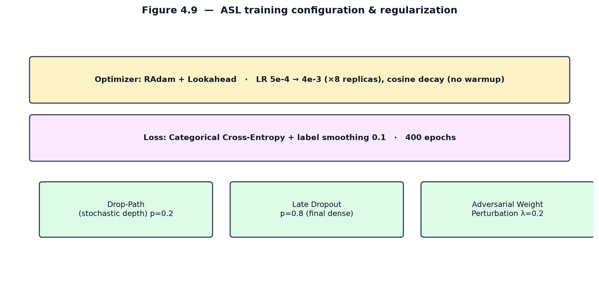

**Figure 4.9 — ASL training configuration & regularization.**

The resulting training curves are shown in Fig. 4.10. The model reaches a validation
accuracy of approximately 0.80 on the competition metric; on the project's own test
split it attains **88%** accuracy. Validation accuracy exceeding training accuracy is
expected here, because the heavy augmentation and regularization are active only
during training.

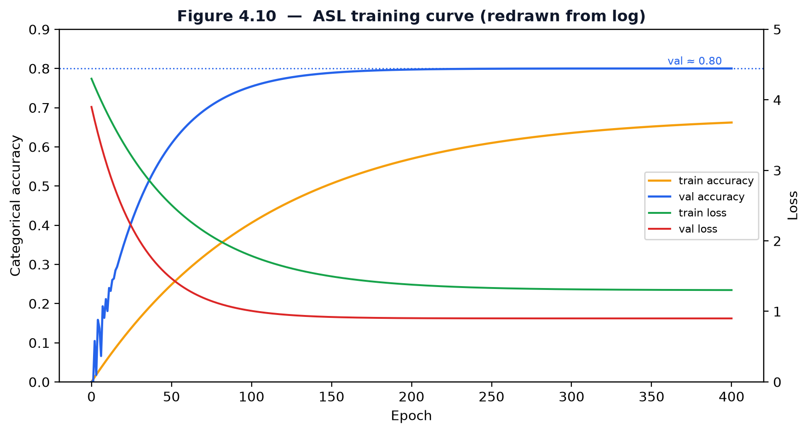

**Figure 4.10 — ASL training curves (redrawn from log).**

## 4.3 The ArSL Recognition Model

### 4.3.1 Preprocessing

The ArSL pipeline (Fig. 4.11) extracts **59 MediaPipe landmarks** — 17 upper-body
pose points (indices 0–16) and 21 points per hand — from each clip. The z axis is
**zeroed** (only x, y carry information) to avoid depth-scaling distortion across
phone cameras; coordinates are centred on the shoulder midpoint and scaled by the
shoulder width for position and scale invariance; and every clip is resampled to a
fixed **30 frames**, producing a (30, 177) tensor.

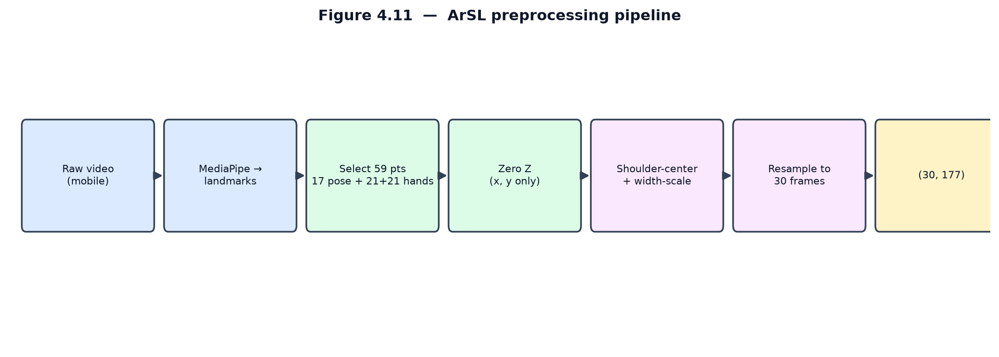

**Figure 4.11 — ArSL preprocessing pipeline.**

### 4.3.2 Architecture

The ArSL model is a compact CNN-GRU (Fig. 4.12). Two 1-D convolutional blocks
(177→128 then 128→128, kernel 3, each with batch normalisation and ReLU) extract
local spatio-temporal features; a two-layer **bidirectional GRU** [29] (128→64
hidden units, dropout 0.3) models the temporal dynamics; and two fully connected
layers (128→64 with ReLU and dropout 0.5, then 64→20) with a softmax produce the
prediction.

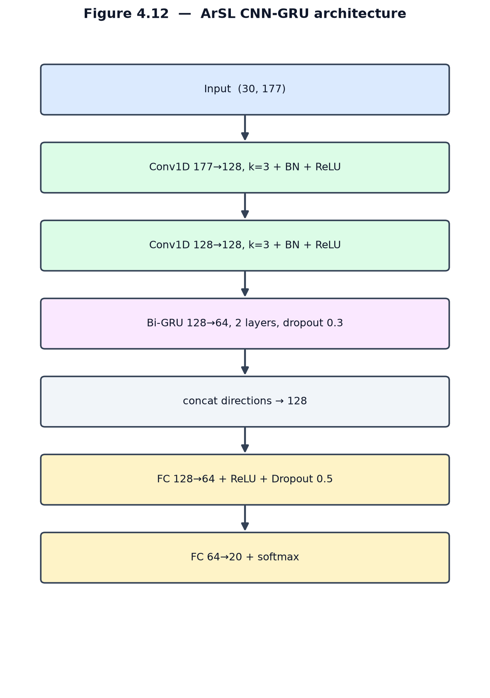

**Figure 4.12 — ArSL CNN-GRU architecture.**

The bidirectional GRU (Fig. 4.13) processes the 30-frame sequence in both temporal
directions and concatenates the forward and backward hidden states, so each
prediction is informed by the full context of the sign.

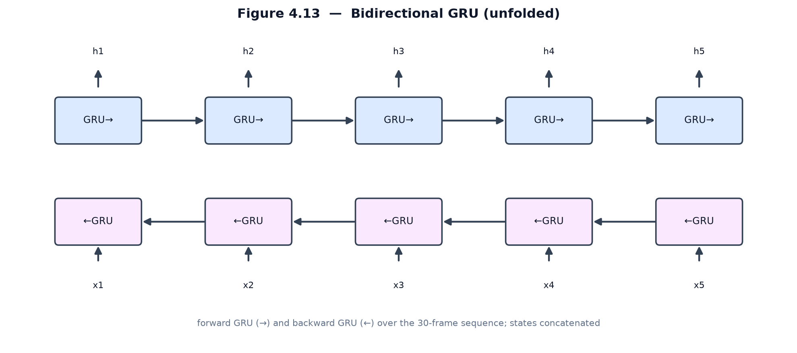

**Figure 4.13 — Bidirectional GRU (unfolded).**

### 4.3.3 Augmentation and training

The ArSL model is trained with the four online augmentations of Fig. 4.14:
horizontal mirroring (50%), inactive-hand masking (70%, detected by spatial
variance), affine scaling (0.92×–1.08×) with Gaussian noise (σ = 0.008), and
temporal jittering. Training uses the Adam optimizer (weight decay 1e-4) at a
learning rate of 1e-3 with a ReduceLROnPlateau schedule (halving after 3 stagnant
epochs), a standard cross-entropy loss, and a batch size of 64, for up to 100 epochs
with early stopping (patience 12). The model attains **99.41%** accuracy on its test
split.

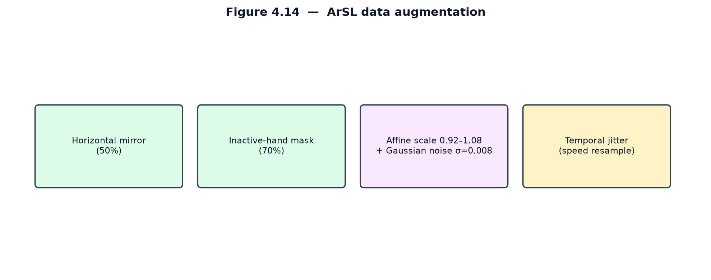

**Figure 4.14 — ArSL data augmentation.**

> Note: the ArSL model is evaluated only on a stratified 80/10/10 split of a single
> dataset whose 72 signers appear across all splits. It therefore may exhibit
> identity leakage; a signer-independent (leave-one-signer-out) protocol is
> recommended future work (Chapter 6).

## 4.4 Gloss-to-Sentence Translation

Once a gloss sequence has been committed, it is converted into a fluent sentence by
a large language model behind a single endpoint. The primary provider is Gemini
[31], prompted with few-shot examples that enforce Topic–Comment reordering and the
insertion of function words; results are cached for repeated phrases. When no cloud
provider is reachable, the chain falls back to a local LLaMA-based model served by
Ollama [32], and ultimately to emitting the raw gloss, so the feature degrades
gracefully rather than failing.

## 4.5 Sign Synthesis

The reverse direction maps a sentence to gloss and retrieves a sign for each token.
Rather than exact string matching, retrieval uses **Sentence-BERT** embeddings [30]
stored in pgvector, so a synonym or paraphrase still selects the correct sign. The
retrieved landmark sequences are stitched and played by the avatar.

## 4.6 Real-Time Integration

The runtime pipeline for the ASL model is shown in Fig. 4.15. In the browser, webcam frames at 30 FPS
are converted to landmarks, smoothed and gap-filled (missing hands sent as NaN, not
zero), and buffered to 60 frames before being posted to `/api/translate`. The server
runs the TFLite interpreter, applies the 0.80 acceptance gate, performs a majority
vote over the last 15 predictions, accumulates gloss, and — after five seconds of no
hands — calls the language model and `/api/tts`. The meeting mode layers this on a
peer-to-peer WebRTC connection [33] coordinated by Socket.IO.

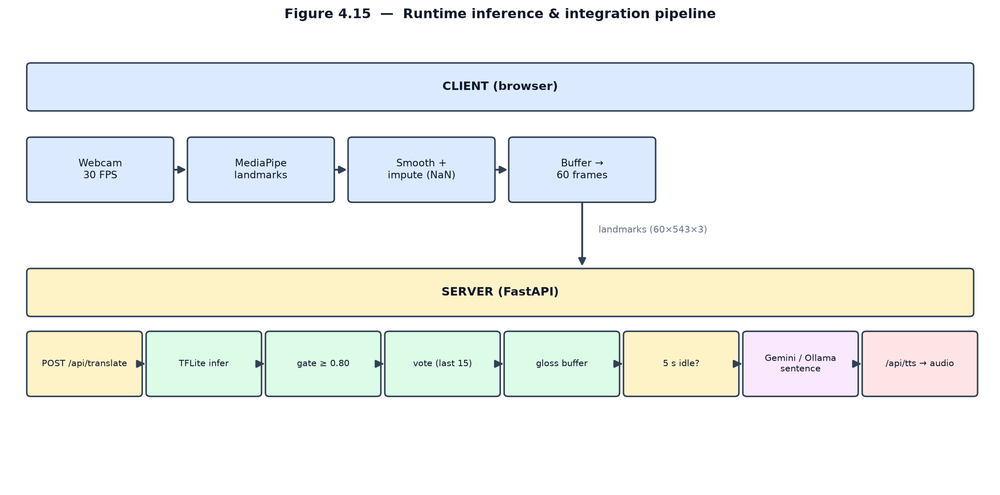

**Figure 4.15 — ASL runtime inference & integration pipeline.**

The ArSL model follows an analogous pipeline, shown in Fig. 4.16, with two
differences: its preprocessing runs **server-side in PyTorch** rather than inside a
TFLite graph — resampling the buffered clip to 30 frames over the 59 selected
landmarks — and its acceptance gate is **0.65** rather than 0.80.

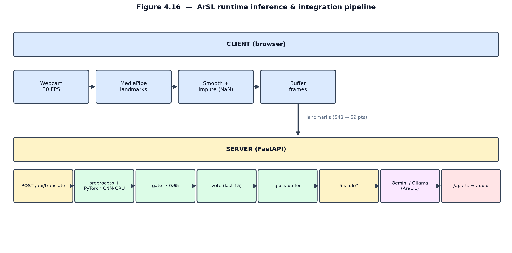

**Figure 4.16 — ArSL runtime inference & integration pipeline.**

## 4.7 Model Comparison

Fig. 4.17 contrasts the two models side by side. They share a landmark-based,
z-free input philosophy but diverge in scale and backbone: a transformer-based
Squeezeformer exported to TFLite for the 250-class ASL task, and a lightweight
PyTorch CNN-GRU for the 20-class ArSL task.

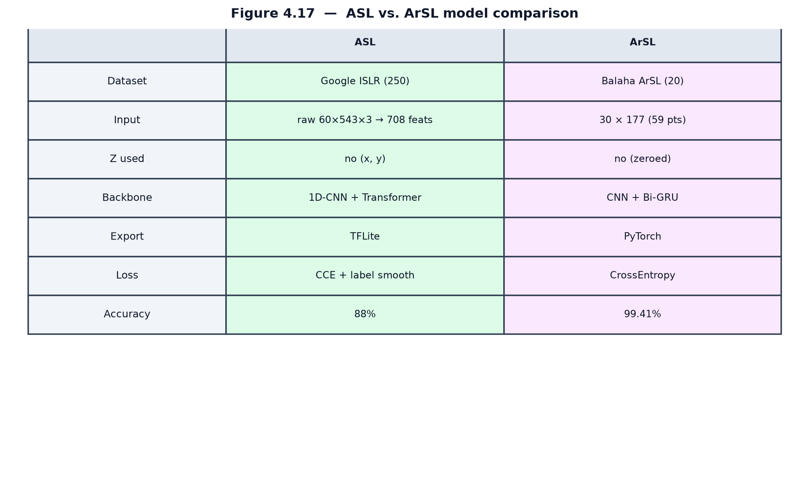

**Figure 4.17 — ASL vs. ArSL model comparison.**

The testing and validation of these models and of the end-to-end system — including
the translation-quality metrics of Chapter 2's evaluation lenses — are reported in
Chapter 5.
