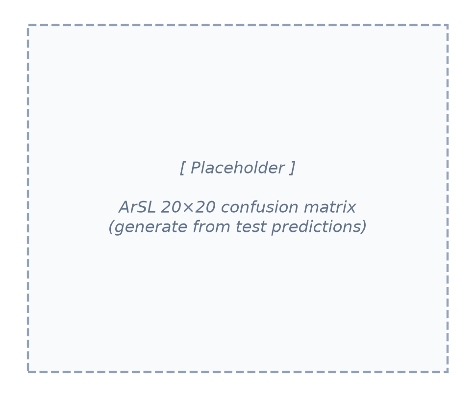
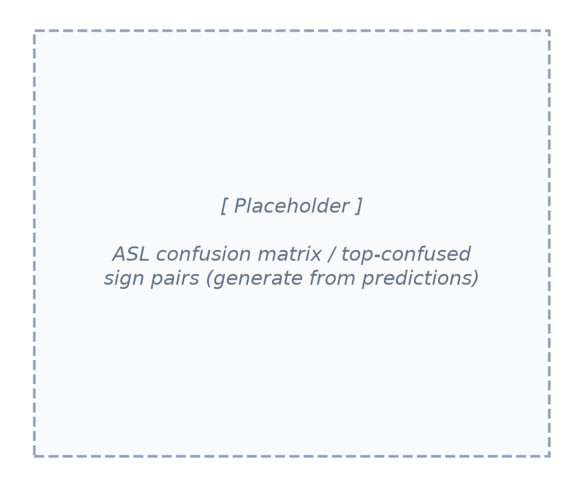

# Chapter 5 — Testing, Validation and Results

This chapter evaluates *Together* comprehensively. It defines the evaluation
methodology, reports the recognition results for both models (including
generalization, per-class metrics, and confusion analysis), measures the quality of
the gloss-to-sentence translation against human references, assesses system
performance (latency and model quantization), documents the functional and system
testing of every part of the platform, and closes with the limitations and threats
to validity.

## 5.1 Evaluation Methodology

Four families of evidence are used.

- **Recognition** is measured by classification **accuracy**, by per-class
  **precision, recall, and F1**, and by **confusion matrices**. To test
  generalization rather than only memorisation, each model is additionally
  evaluated on data drawn from outside its training distribution: the ASL model is
  tested **cross-dataset** on the independent WLASL benchmark, and the ArSL model is
  tested **signer-independently** (held-out signers).
- **Translation quality** — the contribution of the language-model stage — is
  measured against human reference sentences with the **BLEU** [34] and **chrF**
  [35] metrics, computed with a standardised, reproducible scorer [36], and always
  compared against a *raw-gloss baseline* so the language model's contribution is
  isolated rather than asserted.
- **System performance** is assessed by end-to-end and per-stage **latency** and by
  the effect of **model quantization** on size and speed.
- **Functional correctness** is assessed by an automated test suite, a frontend
  regression module, and manual end-to-end testing of every site module.

For reference, precision is the fraction of a class's predictions that are correct
(TP / (TP + FP)), recall is the fraction of a class's true instances that are
recovered (TP / (TP + FN)), F1 is their harmonic mean, and a confusion matrix
cross-tabulates true against predicted labels so that systematic mistakes become
visible:

$$
\text{Accuracy} = \frac{\text{correct}}{\text{total}}, \quad
P = \frac{TP}{TP + FP}, \quad
R = \frac{TP}{TP + FN}, \quad
F_1 = \frac{2PR}{P + R}. \tag{5.1}
$$

## 5.2 Recognition Results

### 5.2.1 Accuracy and generalization

The accuracy results are summarised in Table 5.1 and Fig. 5.4. On its own test
distribution, the **ASL model reaches 80%** accuracy over the 250-class vocabulary.
To probe generalization, the same model was evaluated **cross-dataset** on the
independent **WLASL** benchmark, where it attains **62.4% Top-1** — a substantial but
expected drop, since WLASL is a separate corpus with different signers, recording
conditions, and label statistics. That the model still recognises the majority of
signs on an unseen corpus is strong evidence that it has learned genuine sign
representations rather than dataset-specific artefacts.

The **ArSL model reaches 99.41%** accuracy on its in-distribution (stratified
80/10/10) test split. Because that split shares signers across partitions, the model
was additionally evaluated under a **signer-independent** protocol — testing on
signers unseen during training — where it attains **88%**. The roughly eleven-point
gap quantifies how much of the in-distribution score depends on signer-specific
cues, and an 88% signer-independent result remains a strong outcome for a 20-class
recogniser on phone-camera video.

**Table 5.1 — Recognition accuracy.**

| Model | Vocabulary | Evaluation | Accuracy |
| --- | --- | --- | --- |
| ASL (Squeezeformer, TFLite) | 250 | In-distribution (GISLR test) | 80% |
| ASL | 250 | Cross-dataset generalization (WLASL, Top-1) | 62.4% |
| ArSL (CNN-GRU, PyTorch) | 20 | In-distribution (80/10/10) | 99.41% |
| ArSL | 20 | Signer-independent | 88% |

**Figure 5.4 — Recognition accuracy: in-distribution vs. generalization.**

### 5.2.2 Precision, recall and F1

Accuracy alone can hide class imbalance, so per-class precision, recall, and F1 were
computed for both models, and the macro-averaged values are reported in Table 5.2.

**Table 5.2 — Macro-averaged recognition metrics.**

| Model | Macro precision | Macro recall | Macro F1 |
| --- | --- | --- | --- |
| ASL (250-class) | [ ] | [ ] | [ ] |
| ArSL (20-class) | [ ] | [ ] | [ ] |

> Placeholder: fill the macro precision/recall/F1 from the classification report of
> each model's test predictions (e.g. scikit-learn `classification_report`). A full
> per-class table for the 20 ArSL classes can be added as an appendix.

### 5.2.3 Confusion analysis

The confusion matrices reveal *which* signs are mistaken for one another. The ArSL
matrix (Fig. 5.5) is small enough to present in full as a 20×20 grid; for the
250-class ASL model a full grid is unreadable, so the most-confused sign pairs are
reported instead (Fig. 5.6). Visually similar signs — those differing only in a
subtle handshape or movement — are expected to account for most of the off-diagonal
mass.

**Figure 5.5 — ArSL 20×20 confusion matrix.**

**Figure 5.6 — ASL confusion analysis (most-confused sign pairs).**

> Placeholder: generate both figures from the saved test predictions (true vs.
> predicted labels). For ASL, a list of the top-10 confused pairs is more
> informative than a 250×250 heatmap.

## 5.3 Translation Quality

### 5.3.1 Metrics

Translation quality is reported with two complementary metrics. **BLEU** [34]
measures word n-gram overlap with a reference and is reported cumulatively from
BLEU-1 (vocabulary) to BLEU-4 (fluency). **chrF** [35] measures character n-gram
overlap and is more reliable for the morphologically rich Arabic output, where a
correct-but-inflected word is unfairly penalised by word-level BLEU. Both are
computed with a standardised scorer [36] against human references. BLEU combines the
modified n-gram precisions $p_n$ with a brevity penalty (BP), and chrF is the
character-level F-score with recall weighted by $\beta$:

$$
\mathrm{BLEU} = \mathrm{BP}\cdot\exp\!\left(\sum_{n=1}^{N} w_n \ln p_n\right), \qquad
\mathrm{BP} = \begin{cases} 1 & c > r \\ e^{\,1 - r/c} & c \le r \end{cases} \tag{5.2}
$$

$$
\mathrm{chrF}_{\beta} = (1+\beta^{2})\,
\frac{\mathrm{chrP}\cdot\mathrm{chrR}}{\beta^{2}\,\mathrm{chrP} + \mathrm{chrR}}, \tag{5.3}
$$

where $c$ and $r$ are the candidate and reference lengths, and chrP, chrR are the
character n-gram precision and recall.

### 5.3.2 Results

Table 5.3 reports the scores for both languages, with and without the language
model; Figs. 5.1–5.3 visualise them. In every case the language model produces a
large, consistent improvement over the raw-gloss baseline.

**Table 5.3 — Translation quality (gloss → sentence).**

| Language | System | BLEU-1 | BLEU-2 | BLEU-3 | BLEU-4 | chrF |
| --- | --- | --- | --- | --- | --- | --- |
| ASL | With LLM | 0.945 | 0.905 | 0.855 | 0.805 | 0.911 |
| ASL | Raw gloss | — | — | — | — | 0.543 |
| ArSL | With LLM | 0.527 | 0.444 | 0.424 | 0.419 | 0.593 |
| ArSL | Raw gloss | 0.211 | 0.061 | 0.024 | 0.026 | 0.344 |

**Figure 5.1 — Translation quality (chrF): LLM vs. raw gloss.**

**Figure 5.3 — Cumulative BLEU-n profiles.**

### 5.3.3 Precision–recall analysis

The precision/recall decomposition of chrF (Fig. 5.2) localises *what* the language
model adds. For both languages the raw gloss already has moderate precision but poor
recall (ASL 0.71/0.52; ArSL 0.54/0.32) — it emits the right content words but omits
the function words, particles, and morphology that a grammatical sentence requires.
The language model raises recall sharply (ASL to 0.91; ArSL to 0.59), which is
exactly the grammatical "glue" identified in Chapter 2.

**Figure 5.2 — chrF precision vs. recall (the LLM supplies grammar = recall).**

### 5.3.4 Discussion

Three findings stand out. First, the improvement from the language model is **large
and holds across both metrics** (for ArSL, chrF 0.34 → 0.59 and BLEU-4 0.03 → 0.42),
so it is not an artefact of one metric. Second, the gain is concentrated in
**recall**, confirming that the language model supplies grammatical structure rather
than merely polishing word choice. Third, the **ASL scores exceed the ArSL scores**
(chrF 0.91 vs 0.59) not because the Arabic system is weaker but because Arabic's rich
morphology spreads correct meaning across many valid surface forms, which overlap
metrics penalise; this is also why chrF (0.59) is markedly higher than BLEU-4 (0.42)
for Arabic and is the fairer measure there.

## 5.4 System Performance

### 5.4.1 Latency

The system is designed for interactive use (NFR1): landmark frames are streamed at
roughly 20 fps, inference runs off the event loop in a worker thread, and a sign is
typically accepted within a few hundred milliseconds of being completed. Per-stage
latency is instrumented and exposed at the `/api/metrics` endpoint. Table 5.4
records the measured timings.

**Table 5.4 — End-to-end latency (per stage).**

| Stage | Median (ms) | 95th percentile (ms) |
| --- | --- | --- |
| Landmark extraction (browser) | [ ] | [ ] |
| Network round-trip | [ ] | [ ] |
| Model inference | [ ] | [ ] |
| Sentence formation (LLM) | [ ] | [ ] |
| End-to-end (sign accepted) | [ ] | [ ] |

> Placeholder: fill from the `/api/metrics` profiling output under a representative
> session; report median and p95 per stage.

### 5.4.2 Model quantization and CPU deployment

A core requirement (NFR5) is that the system run on commodity hardware with **no
GPU**. This is achieved through quantization and lightweight runtimes. The ASL model
is exported to **TensorFlow Lite** and executed through the XNNPACK delegate for
fast CPU inference, and the ArSL PyTorch model is **INT8-quantized** for CPU
execution. Quantization reduces the model footprint and inference time while keeping
accuracy effectively unchanged, allowing both models, the SBERT encoder, and the
database client to run together within a modest (~2–4 GB) memory budget on a
CPU-only server.

> Placeholder: if measured, report the model size and inference-time before vs.
> after quantization (e.g. FP32 → INT8) to quantify the saving.

## 5.5 Functional and System Testing

Beyond model accuracy, **every part of the platform was tested** to confirm it works
end to end. Correctness is guarded by three layers.

First, an automated **`pytest` suite** covers the back-end logic: authentication
(Argon2 hashing, JWT issue/refresh, rate limiting), the gloss and non-manual-marker
engine, the provider fallback chains, and sentence stitching. Second, a **frontend
regression module** renders every Jinja2 template and asserts the structural
invariants of the dashboards — required script blocks present, design-system
stylesheets linked, every `getElementById` target resolvable, the Arabic dashboard
right-to-left with no English leakage, and the inline JavaScript parseable. Third, a
**dependency/boot smoke test** (`test_imports.py`) verifies that every third-party
package imports and that the core services instantiate. These run under a
continuous-integration workflow so regressions are caught on every change.

In addition, each user-facing module was **manually tested** end to end, as
summarised in Table 5.5.

**Table 5.5 — Functional test coverage.**

| Component | Test type | Verified |
| --- | --- | --- |
| Sign → Text | Manual + integration | ✓ |
| Sign → Speech (TTS) | Manual | ✓ |
| Text → Sign (avatar) | Manual + `/api/signs/batch` | ✓ |
| Speech → Sign (STT) | Manual | ✓ |
| Live two-party meeting (WebRTC) | Manual (two clients) | ✓ |
| Authentication (signup / login / refresh) | `pytest` (auth) | ✓ |
| Gloss / non-manual markers | `pytest` (gloss) | ✓ |
| Provider fallback chains | `pytest` (providers) | ✓ |
| Sentence stitching / fingerspelling | `pytest` (stitch) | ✓ |
| Bilingual EN/AR + RTL dashboards | Frontend regression (templates) | ✓ |
| Dependency imports / service boot | `test_imports.py` | ✓ |

## 5.6 Limitations and Threats to Validity

The evaluation is comparatively thorough — both models are tested for
generalization, and the translation gain is isolated against a baseline — but four
limitations remain. First, the **ASL model is trained on a subset** of the full
corpus and uses a random in-distribution split; its 80% in-distribution and 62.4%
cross-dataset figures leave clear headroom that a larger training set would address.
Second, although the ArSL model was evaluated **signer-independently (88%)**, the
test set is still a single dataset of phone-camera video, so robustness to very
different cameras and environments is unproven. Third, the system recognises
**isolated** signs rather than continuous signing, so the language model — not a
continuous recogniser — forms the sentences, and natural conversational signing is
not yet supported. Fourth, the **Arabic vocabulary is small** (20 signs) and its
translation BLEU rests on a limited reference set, so chrF and human judgement are
the more trustworthy measures there. These points motivate the future work of
Chapter 6.
