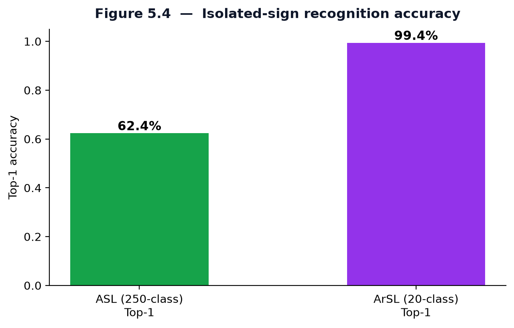
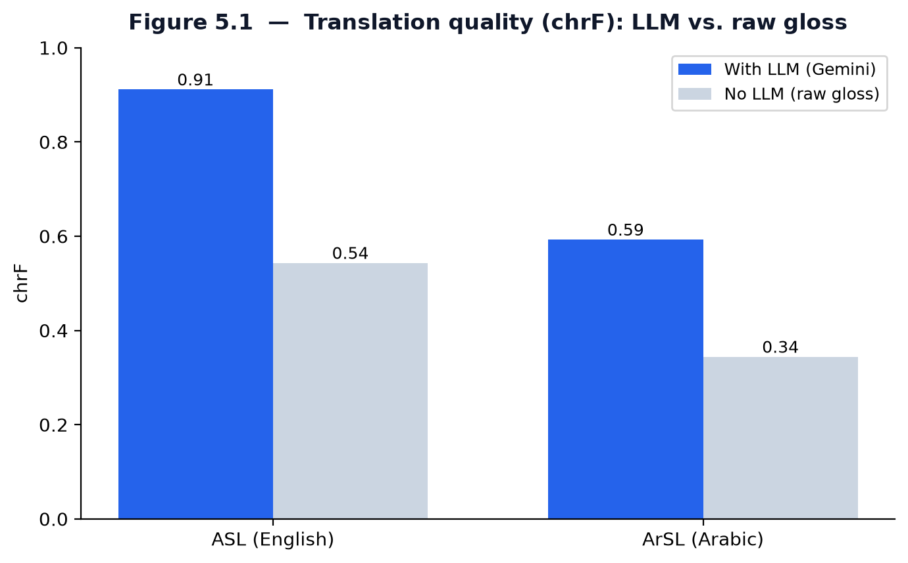
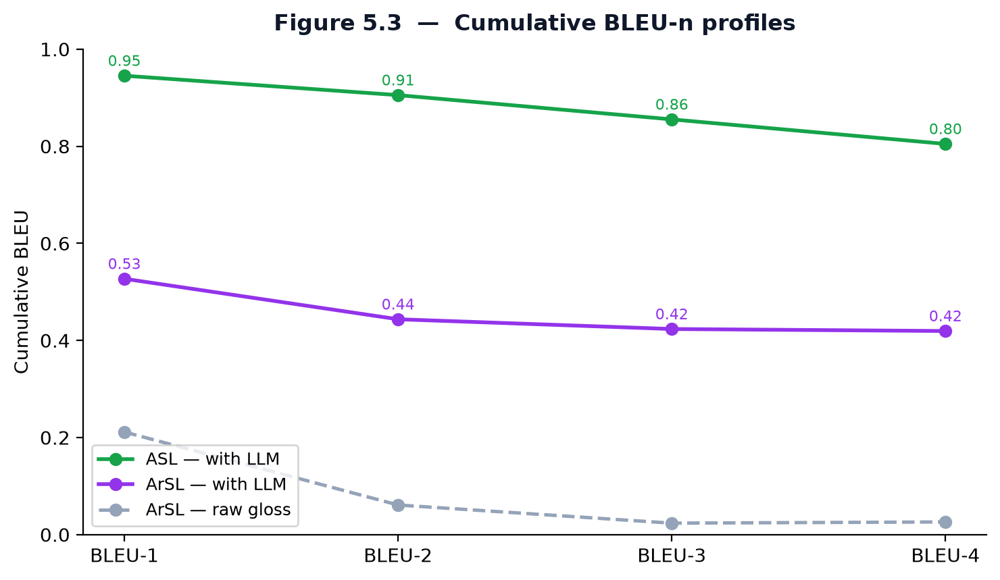
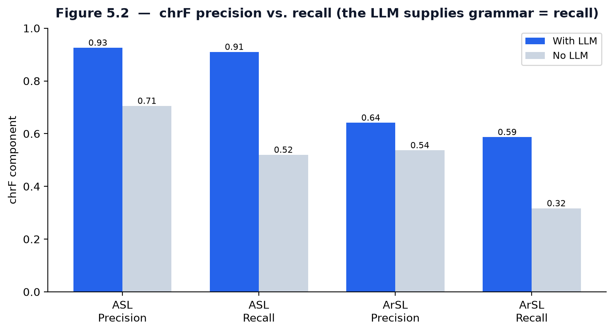

# Chapter 5 — Testing, Validation and Results

This chapter evaluates *Together* along the three dimensions that matter for the
project's aims: the accuracy of the two recognition models, the quality of the
gloss-to-sentence translation, and the behaviour of the integrated system. It then
reports functional testing and discusses the limitations of the evaluation.

## 5.1 Evaluation Methodology

Three families of evidence are used. **Recognition** is measured as classification
accuracy on held-out test splits. **Translation quality** — the contribution of the
language-model stage — is measured against human reference sentences with the BLEU
[34] and chrF [35] metrics, computed with a reproducible scorer [36]. **System
behaviour** is assessed through latency profiling and an automated test suite. For
the translation evaluation, each system is compared against a *raw-gloss baseline*
(the recognised tokens joined without the language model) so that the LLM's
contribution can be isolated rather than merely asserted.

## 5.2 Recognition Results

The two recognition models were evaluated on stratified held-out test splits, as
summarised in Table 5.1 and Fig. 5.4. The ASL model attains **62.4% Top-1 accuracy**
over its 250-class vocabulary — a strong result for a large-vocabulary isolated-sign
task, where even heavy video models such as I3D reach only the low-30s on a
comparable 2,000-class benchmark. The ArSL model attains **99.41%** over its
20-class vocabulary.

**Table 5.1 — Recognition results.**

| Model | Classes | Test split | Top-1 accuracy |
| --- | --- | --- | --- |
| ASL (Squeezeformer, TFLite) | 250 | 68/18/14 | 62.4% |
| ArSL (CNN-GRU, PyTorch) | 20 | 80/10/10 | 99.41% |

**Figure 5.4 — Isolated-sign recognition accuracy.**

The two figures are not directly comparable: the ArSL task has an order of magnitude
fewer classes, and — importantly — its split is **signer-dependent** (the same 72
signers appear in train and test), so the 99.41% should be read as an upper bound
that may include identity leakage (Section 5.6). The ASL split is likewise a random
partition rather than a signer-independent one.

> Note: if a Top-5 (or other top-k) accuracy was also computed for the ASL model,
> report it alongside the Top-1 figure here (e.g. "Top-5: XX%"); Top-1 is the
> headline accuracy and Top-5 a useful secondary measure for a 250-class task.

## 5.3 Translation Quality

### 5.3.1 Metrics

Translation quality is reported with two complementary metrics. **BLEU** [34]
measures word n-gram overlap with a reference and is reported cumulatively from
BLEU-1 (unigram, vocabulary) to BLEU-4 (4-gram, fluency). **chrF** [35] measures
character n-gram overlap and is more reliable for the morphologically rich Arabic
output, where a correct-but-inflected word is unfairly penalised by word-level BLEU.
Both are computed with a standardised scorer [36] against human references.

### 5.3.2 Results

Table 5.2 reports the scores for both languages, with and without the language
model; Figs. 5.1–5.3 visualise them. In every case the LLM stage produces a large,
consistent improvement over the raw-gloss baseline.

**Table 5.2 — Translation quality (gloss → sentence).**

| Language | System | BLEU-1 | BLEU-2 | BLEU-3 | BLEU-4 | chrF |
| --- | --- | --- | --- | --- | --- | --- |
| ASL | With LLM | 0.945 | 0.905 | 0.855 | 0.805 | 0.911 |
| ASL | Raw gloss | — | — | — | — | 0.543 |
| ArSL | With LLM | 0.527 | 0.444 | 0.424 | 0.419 | 0.593 |
| ArSL | Raw gloss | 0.211 | 0.061 | 0.024 | 0.026 | 0.344 |

**Figure 5.1 — Translation quality (chrF): LLM vs. raw gloss.**

**Figure 5.3 — Cumulative BLEU-n profiles.**

### 5.3.3 Analysis

Three findings stand out. First, the improvement from the language model is **large
and holds across both metrics**: for ArSL, chrF rises from 0.34 to 0.59 and BLEU-4
from 0.03 to 0.42, so the result is not an artefact of one quirky metric. Second,
the **precision/recall breakdown of chrF (Fig. 5.2) localises what the LLM adds.**
For both languages the raw gloss already has moderate precision but poor recall
(ASL 0.71/0.52; ArSL 0.54/0.32) — it emits the right content words but omits the
function words, particles, and morphology that a grammatical sentence needs. The LLM
raises recall sharply (ASL to 0.91; ArSL to 0.59), which is precisely the
grammatical "glue" identified in Chapter 2. Third, the **ASL scores exceed the ArSL
scores** (chrF 0.91 vs 0.59) not because the Arabic system is weaker but because
Arabic's rich morphology spreads correct meaning across many valid surface forms,
which word- and character-overlap metrics penalise; this is also why chrF (0.59)
is markedly higher than BLEU-4 (0.42) for Arabic and is the fairer measure there.

**Figure 5.2 — chrF precision vs. recall (the LLM supplies grammar = recall).**

## 5.4 System Performance

The system is designed for interactive use (NFR1): landmark frames are streamed at
roughly 20 fps, inference runs off the event loop in a worker thread, and a sign is
typically accepted within a few hundred milliseconds of being completed. Per-stage
latency is instrumented and exposed at the `/api/metrics` endpoint, and the
provider chains keep the experience responsive by falling back to local components
when a cloud provider is slow or unavailable.

> Note: insert the measured latency numbers here — e.g. median and 95th-percentile
> per stage (landmark extraction, network round-trip, inference, sentence
> formation) from `/api/metrics` — to turn this qualitative claim into a reported
> result.

## 5.5 Functional Testing

Correctness of the back-end is guarded by an automated `pytest` suite covering
authentication (hashing, tokens, rate limiting), the gloss and non-manual-marker
logic, the provider chains, and sentence stitching. A dedicated frontend-regression
module additionally renders every template and asserts the structural invariants of
the dashboards (required script blocks present, design-system stylesheets linked,
every `getElementById` target resolvable, the Arabic dashboard right-to-left with no
English leakage, and the inline JavaScript parseable). The suite runs under a
continuous-integration workflow so regressions are caught on every change.

## 5.6 Limitations and Threats to Validity

Four limitations qualify the results above. First, **the ArSL evaluation is
signer-dependent**: because the same 72 signers appear across the train, validation,
and test splits, the 99.41% may overstate real-world performance through identity
leakage; the dataset's original authors reported a signer-independent figure near
98%, so a leave-one-signer-out protocol is the right comparison and is left to future
work. Second, **the ASL model is trained on a 4,078-sequence subset** of the full
corpus and uses a random rather than signer-independent split. Third, the **ArSL
translation BLEU rests on a small reference set**, so chrF and human judgement are
the more trustworthy measures there. Fourth, the system recognises **isolated**
signs rather than continuous signing, so the language model — not a continuous
recogniser — bears the burden of forming sentences. These points are revisited in
the conclusion, where signer-independent evaluation, a larger ASL training set, and
continuous recognition are identified as the principal directions for future work.
